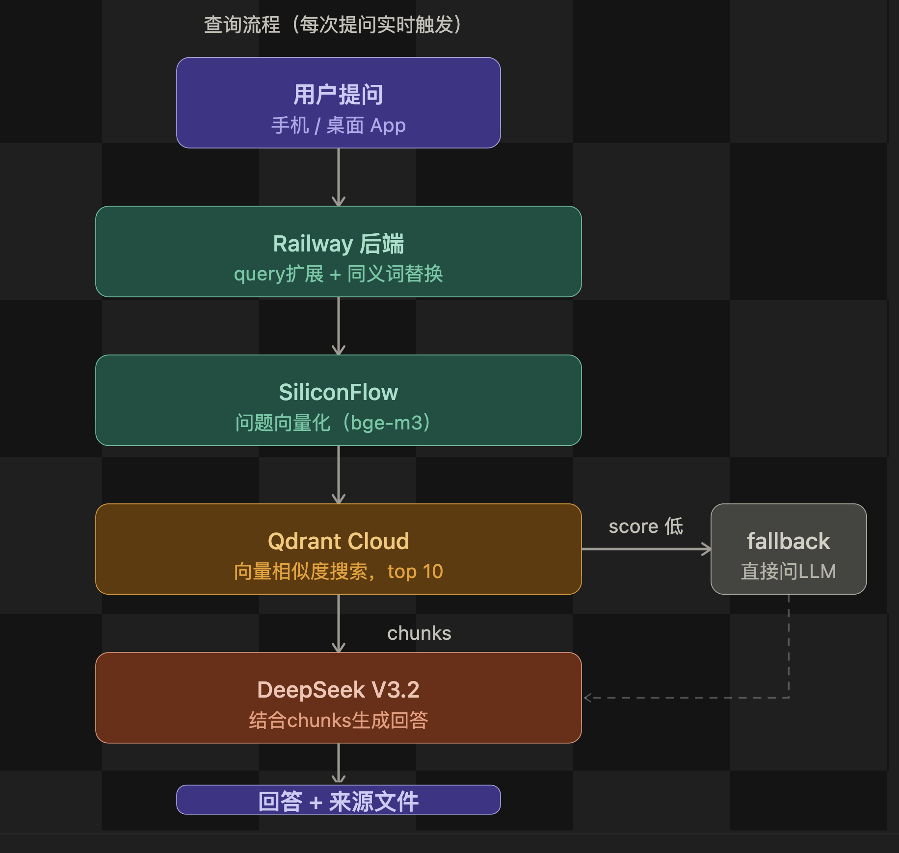

# MagicRAG



一个面向魔术资料的本地 RAG 服务，技术栈是 FastAPI + Qdrant + DeepSeek/OpenAI 兼容接口。

体验地址：[https://magicbag-production.up.railway.app/](https://magicbag-production.up.railway.app/)

- 已支持本地文档扫描、切块、embedding、Qdrant 入库
- 已提供语义搜索和问答接口
- 问答支持基于检索结果生成回答，检索不足时回退到通用模型回答

## 快速开始

```bash
python3 -m venv .venv
source .venv/bin/activate
pip install -r requirements.txt
cp .env.example .env
uvicorn app.main:app --reload --host 0.0.0.0 --port 8000
```

启动后可访问：

- `http://127.0.0.1:8000/`
- `http://127.0.0.1:8000/docs`
- `http://127.0.0.1:8000/health`

## 必要配置

至少需要这些环境变量：

```env
RAG_DOCUMENTS_DIR=/path/to/rag_docs
QDRANT_URL=http://localhost:6333
QDRANT_API_KEY=
DEEPSEEK_API_KEY=your_api_key
DEEPSEEK_BASE_URL=https://api.deepseek.com
DEEPSEEK_CHAT_MODEL=deepseek-chat
DEEPSEEK_EMBEDDING_MODEL=BAAI/bge-large-zh-v1.5
```

说明：

- 服务同时接受 `DEEPSEEK_*` 和 `OPENAI_*` 变量名
- `RAG_DOCUMENTS_DIR` 必须是运行环境里真实存在的目录
- 如果没有配置 Qdrant，`/search` 和 `/ingest` 不会正常工作

## 主要接口

- `GET /health`：健康检查
- `GET /stats`：返回文档目录、collection、已索引 chunk 数、模型配置
- `POST /api/v1/rag/ingest`：扫描目录、切块、生成 embedding、写入 Qdrant
- `POST /api/v1/rag/search`：语义检索，`debug=true` 时返回筛选和扩展结果
- `POST /api/v1/rag/query`：基于检索结果生成回答，支持 `history`

## 常用命令

```bash
pytest -q
```

```bash
uvicorn app.main:app --reload
```

## 项目结构

```text
.
├── app
│   ├── api
│   ├── core
│   ├── db
│   ├── llm
│   ├── models
│   ├── schemas
│   ├── services
│   └── main.py
├── tests
├── .env.example
├── Dockerfile
├── requirements.txt
└── README.md
```
